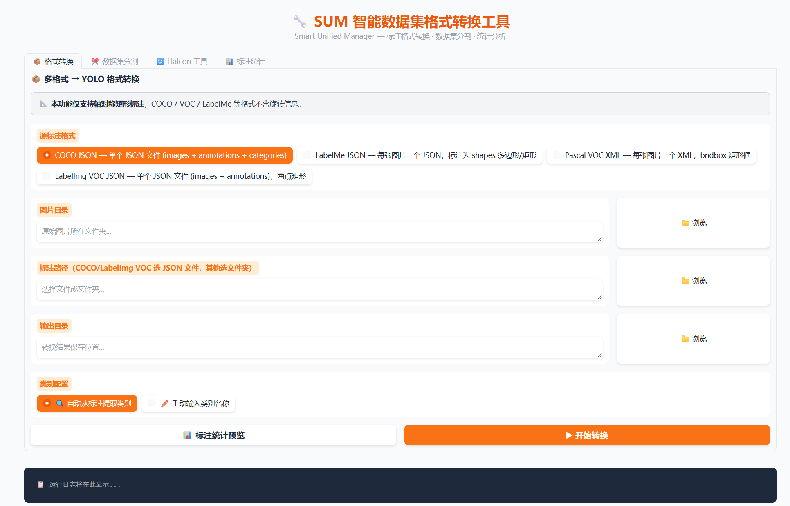

# SUM Dataset Annotation Format Converter

[简体中文](README.md) | [English](README_EN.md)

SUM (Smart Unified Manager) is a local tool for object detection datasets. It converts annotation formats, splits datasets, and summarizes YOLO annotations. Built with Python and Gradio, it runs locally and is operated through a web browser. You select your datasets on your own computer; dataset files are not included in this repository.

## Screenshot



The screenshot shows the format conversion page. The page displays the input directories, annotation files, category settings, and output paths relevant to the selected conversion.

## Features

| Feature | Supported formats and functions |
| --- | --- |
| Convert to YOLO | COCO JSON, LabelMe JSON, Pascal VOC XML, LabelImg VOC JSON, and Halcon DLDataset JSON |
| YOLO to Halcon | YOLO axis-aligned and OBB rotated boxes; generates a reference JSON file and an `.hdvp` script for HDevelop |
| Dataset splitting | COCO, YOLO, VOC XML, and LabelMe; split data using specified ratios |
| YOLO statistics | Summarize image and annotation counts, class distribution, and images with empty annotations |
| Input validation and logs | Report common issues with classes, coordinates, images, and file formats |

## Supported Formats and Coordinate Notes

| Conversion | Annotation format | Notes |
| --- | --- | --- |
| COCO → YOLO | JSON `bbox` | Interprets boxes as `[x, y, width, height]` and writes normalized YOLO axis-aligned boxes |
| LabelMe → YOLO | JSON shapes | Converts polygons/rectangles to axis-aligned bounding boxes, then writes normalized coordinates |
| Pascal VOC XML → YOLO | XML object/bndbox | Reads classes and rectangular boxes, then converts them to normalized YOLO coordinates |
| LabelImg VOC JSON → YOLO | JSON bbox | Interprets `bbox` as `[xmin, ymin, xmax, ymax]` |
| Halcon → YOLO | DLDataset JSON | Supports rectangle1 and rectangle2; rectangle2 is converted to an axis-aligned bounding box |
| YOLO → Halcon | TXT | Supports standard 5-column axis-aligned boxes, 6-column YOLO OBB, and 9-column four-point OBB |

Coordinates are normalized using each image's width and height. Class IDs follow the order in the selected class configuration or dataset. Use a consistent number of columns throughout each YOLO dataset; do not mix axis-aligned and rotated boxes in the same dataset. For non-standard fields or custom class mappings, check the class settings and conversion logs before converting the full dataset.

## Requirements

- Windows 10/11 (the file and folder picker instructions are currently Windows-focused)
- Python 3.9 or a compatible version; the project has been run with Python 3.9.25 and Gradio 4.44.1
- MVTec HALCON is required only if you need native Halcon data; the conversion and script-generation features do not require the Halcon Python package

See [`requirements.txt`](requirements.txt) for direct dependencies and [`依赖库安装说明.txt`](依赖库安装说明.txt) for package details and installation instructions.

## Installation and Launch

Create a dedicated Conda environment to avoid conflicts with other Python projects:

```powershell
conda create -n sum python=3.9 -y
conda activate sum
python -m pip install --upgrade pip
python -m pip install -r requirements.txt
```

From the project root, launch the application:

```powershell
python main.py
```

Then open `http://127.0.0.1:7860` in a browser on the same computer. If the port is already in use, close the program using it or adjust the application's launch configuration.

### File and Folder Picker

The **Browse** buttons open the native Windows file or folder picker. By default, the picker starts in the application's working directory. To set a different starting directory, run the following in the same PowerShell window before launching SUM:

```powershell
$env:SUM_BROWSE_ROOT = 'D:\Date_set'
python main.py
```

You can also paste a local path directly into a path field. Choose a writable output directory for conversions. We recommend checking your settings with a small sample before processing a large dataset.

## Common Workflows

### Convert Annotation Formats

1. On the format conversion page, select a conversion direction and source format.
2. Select the annotation file or dataset directory. If the format requires image dimensions, also select the image directory.
3. Enter class information or mappings as prompted, then select an output directory.
4. Start the conversion and review progress, success/failure counts, and logs.
5. Check the output labels and class configuration. Inspect a sample of images to confirm that classes and boxes are correct.

Formats such as COCO usually require an image index or a corresponding image directory. Duplicate filenames, missing images, malformed annotations, and unknown classes may cause samples to be skipped or reported as failures. Review the summary and logs before processing a full dataset.

### Split a Dataset

Select a supported format, input dataset, and split ratios, then choose an output location. After the split, check that images and labels are paired correctly in each subset. Splitting is generally performed by sample and does not modify the source dataset; using a new, empty output directory makes the results easier to inspect and revert.

### Summarize YOLO Annotations

Select a directory containing images and YOLO labels. The summary can help you review class distribution, empty labels, and the approximate dataset size. Label rows should match the actual format used in the dataset; malformed rows may be reported in the results or logs.

### Convert YOLO to Halcon

The program generates a reference JSON file and an `.hdvp` script. To create a native Halcon `.hdict` file, open and run the script in an installed HALCON/HDevelop environment, and check the image and output paths specified by the script.

## Data and Privacy

- The project reads and writes datasets locally; verify the input and output paths you select.
- This repository does not include personal datasets, sample images, conversion outputs, or commercial Halcon software files.
- Tests use temporary synthetic data by default. If `SUM_TEST_DATA_ROOT` is set, tests may run read-only smoke checks against that directory; generated output remains in a temporary directory.

## License

This project is licensed under the MIT License. See [`LICENSE`](LICENSE). Retain the license and copyright notice when using, modifying, or distributing the software.

## Contact

Thanks for using SUM. If you encounter a problem, find a bug, or have a suggestion, please contact the author at **13971295828@163.com**.
